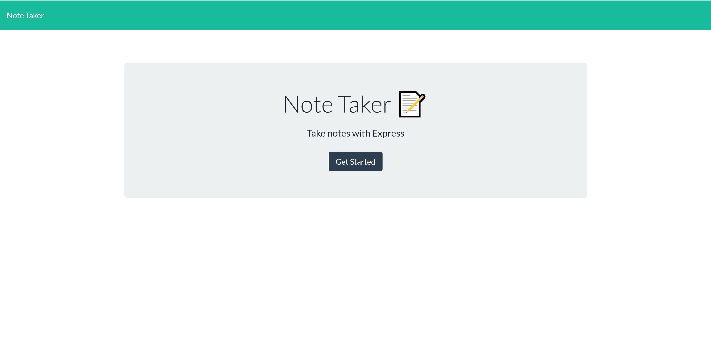
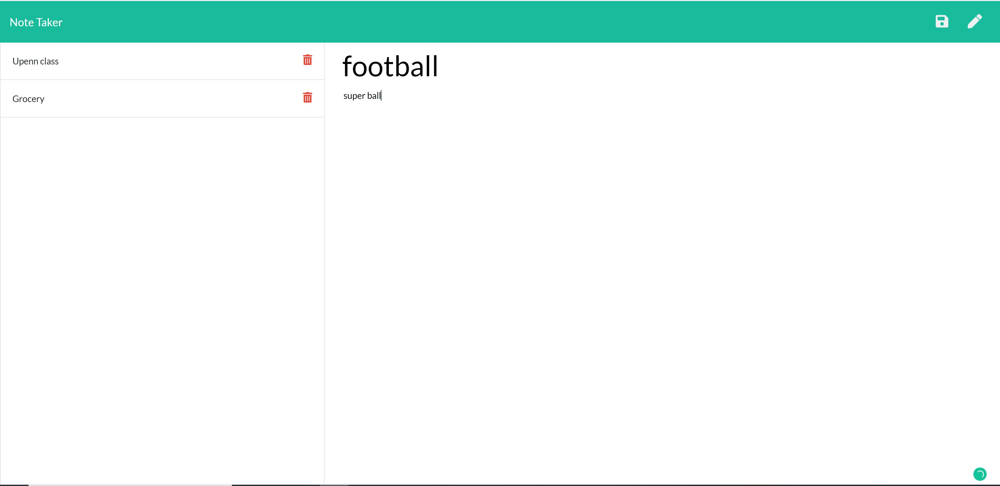

# Note Taker

Note taker is an application that can be used to write, save, and delete notes. This application will use an express backend and save and retrieve note data from a JSON file.

https://note-taker-ad.herokuapp.com/notes

## Acceptance Criteria

Application should allow users to create and save notes.

Application should allow users to view previously saved notes.

Application should allow users to delete previously saved notes.

* The following HTML routes is created:
  * GET `/notes` -  returns the `notes.html` file.
  * GET `*` - returns the `index.html` file

* The application has a `db.json` file on the backend that will store and retrieve notes using the `fs` module.
* The following API routes are created:

  * GET `/api/notes` - reads the `db.json` file and return all saved notes as JSON.
  * POST `/api/notes` - receives a new note to save on the request body, add it to the `db.json` file, and then returns the new note to the client.

  * DELETE `/api/notes/:id` - receives a query parameter containing the id of a note to delete. T

## User Story

    AS A user, I want to be able to write and save notes

    I WANT to be able to delete notes I've written before

    SO THAT I can organize my thoughts and keep track of tasks I need to complete

## Build status
project still in development phase

    Build status of continus integratio
    tools: (to be used):
        1. jenkins
        2. heroku
        3. express
    

## Code style

## Tech/framework used
    node.js

## Features

    1. user friendly
    2. simplified 
    3. Easy Navigation
    4. SEO (Search Engine Optimization)
    5. Mobile Friendly

## Code Example

    1. Used consistent indentation
    2. Followed the DRY Principle
    3. Avoided Deep Nesting
    4. kept Limited line length
    5. standard File and folder structure
    6. standard Naming conventions.
    7. Kept the code simple.

## Installation

https://dasamith.github.io/Employee-Summary/

    To Run the test script: npm run test
    To run the template engine: node app.js

## Screenshot
NA

## API Reference

## Tests
N/A

## Contribute

Let people know how they can contribute into your project. A [contributing guideline](https://github.com/zulip/zulip-electron/blob/master/CONTRIBUTING.md) will be a big plus.

## Credits
upenn coding bootcamp

## License
A short snippet describing the license 

© [Amith Das]()
